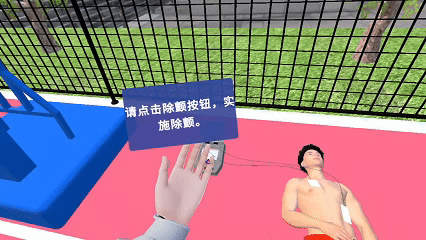
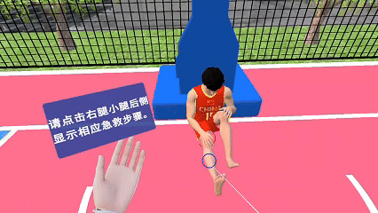
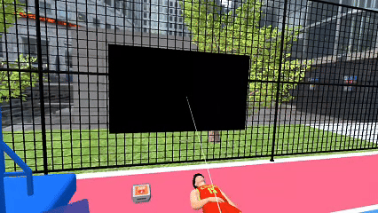

## 救急バーチャルシミュレーションプロジェクト

## コア技術

本プロジェクトでは、**HandUI**コンポーネント、**LineRenderer**コンポーネント、**空間UIビデオ再生システム**を活用し、直感的なインタラクティブユーザーインターフェースとダイナミックな視覚効果を構築する方法を示しています。

### **HandUI コンポーネント**

- 救急手順のテキストヒントを表示するために特別に設計されたインタラクティブコンポーネント

- **DOTween**アニメーションシステムを統合し、テキストのスムーズなフェードイン・フェードアウト効果を実現

- 構造化された`List<StepData>`データ管理により、ユーザーが救急タスクを段階的に確認し、実行できる

- `CanvasGroup`コンポーネントを活用してUI要素の透明度を動的に制御する方法を学ぶ

### **LineRenderer ダイナミック接続ツール**

- **LineRenderer**コンポーネントを使用して、2点間の動的な接続線を描画し、位置データをリアルタイムで更新

- `ExecuteInEditMode`属性を使用して、編集モードでリアルタイムプレビューをサポートし、開発効率を大幅に向上

- `transform.LookAt()`関数を使用して、接続線の端のマーカーが常にプレイヤー視点に向かうようにする

### **空間UIビデオ教育システム**

- **VRUIパッケージ**および**UI Kit for visionOS**を統合し、浮遊するビデオ再生パネルを構築

- インタラクション制御を実現し、ユーザーはコントローラーのレーザーでビデオの再生、停止、進行状況の調整が可能

- ユーザーの位置に応じてUIのサイズと向きをインテリジェントに調整する視野適応機能
